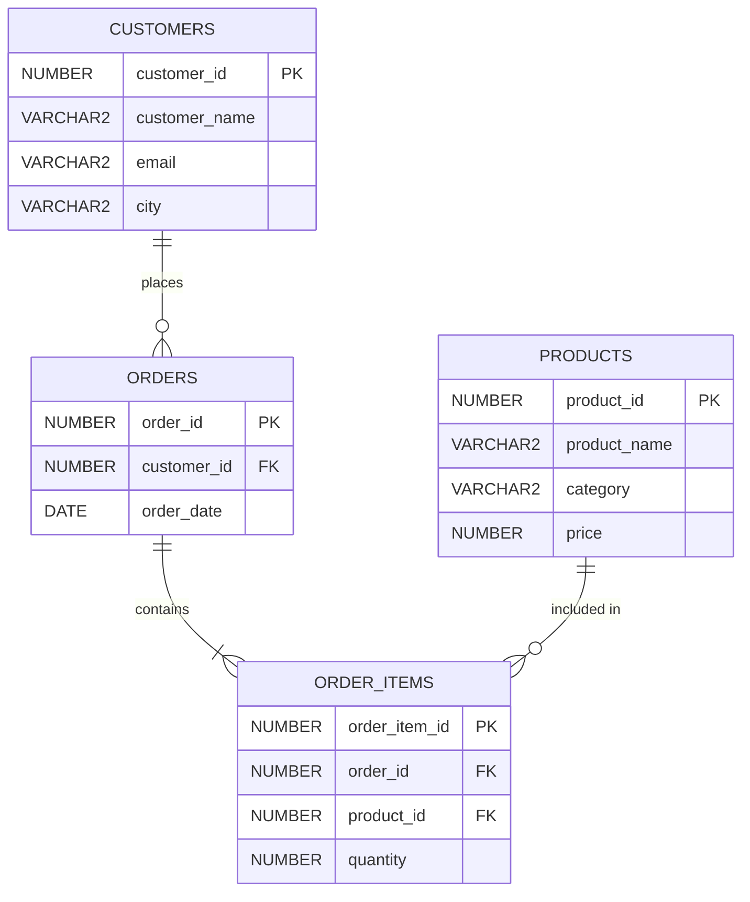

# PL/SQL Assignment One — Sunrise Supermarket

**Course:** Advanced Database Systems / PL/SQL  
**Student Name:** Felicien (Feliciencalyx)  
**Student ID:** `20251SEN197`  
**Group:** Group B / Group C / Group I (due Sep 21, 2026) / Group D (due Sep 23, 2026)  
**Target DBMS:** Oracle AI Database 26ai / 23ai Free (SQL*Plus & Oracle SQL Developer)  
**Repository Name:** `assignment_1_felicien-20251sen197` (or `assignment_1_feliciencalyx-20251sen197`)

---

## 1. Executive Summary & Business Scenario

### Business Context
**Sunrise Supermarket** is a retail grocery store offering fresh produce, dairy essentials, bakery goods, and premium beverages. As the supermarket expands, store leadership faces strategic questions about operational efficiency, inventory demand, and customer loyalty:
- **Who are our most valuable customers?** Identifying high-value shoppers allows marketing to launch VIP retention and loyalty rewards.
- **What do customers purchase together?** Correlating product categories with order items reveals basket size dynamics and seasonal preferences.
- **How is revenue accumulating over time?** Tracking cumulative daily cash flow provides insight into store momentum and sales pacing.
- **How frequently do shoppers return?** Measuring the days elapsed between customer orders highlights repeat purchase velocity and churn risks.

To address these business questions, this project implements a relational schema on **Oracle Database**, populates it with realistic transaction records, and executes sophisticated analytical queries combining **ANSI INNER/LEFT JOINs**, **Common Table Expressions (CTEs)**, and **Window Functions** (`DENSE_RANK`, `ROW_NUMBER`, `SUM() OVER`, `LAG`).

---

## 2. Relational Schema Design & Dataset

### Schema Definition
The database schema consists of four interconnected tables adhering to 3NF normalization:
1. `customers`: Customer profiles with city locations and contact details.
2. `products`: Inventory catalog categorized with retail prices.
3. `orders`: Sales header recording customer placement and order dates.
4. `order_items`: Line-item details linking products to orders with purchased quantities.



### Data Population Summary
The database is loaded with realistic supermarket data exceeding assignment minimums:
- **Customers (8 rows):** Includes shoppers from major metropolitan areas. Specially designed with edge cases:
  - Multi-order regular customers (Alice, Bob, Charlie, Diana, Evan, Fiona).
  - Single-order customer (Hannah Abbott) to test frequency filters.
  - Zero-order prospect (George Miller) to test `LEFT JOIN` handling of `NULL` values.
- **Products (10 rows across 4 categories):** Produce (Bananas, Apples, Spinach), Dairy (Milk, Yogurt, Cheese), Bakery (Sourdough Bread, Croissants), Beverages (Coffee, Green Tea).
- **Orders (17 rows):** Distributed chronologically between January 5, 2026 and March 18, 2026.
- **Order Items (31 rows):** High-variety multi-item shopping baskets with realistic retail quantities.

---

## 3. Database Environment & How to Run

### Database Environment
- **DBMS:** Oracle AI Database 26ai Free Release 23.26.3.0.0
- **Client Tools:** SQL*Plus CLI and Oracle SQL Developer
- **Pluggable Database (PDB):** `FE_PDB_20251SEN197`
- **User Schema:** `FELICIEN_PLSQLAUCA_20251SEN197`

### File Structure
```text
assignment_1_felicien-20251sen197/
├── 01_schema.sql         # Table drops and CREATE TABLE statements
├── 02_data.sql           # Realistic INSERT statements and COMMIT
├── 03_queries.sql        # All 8 JOIN, CTE, and Window Function queries
├── run_all.sql           # Master execution script with formatting
└── README.md             # Comprehensive project documentation
```

### Execution Instructions

#### Method 1: Using SQL*Plus (Recommended)
1. Open PowerShell or Command Prompt.
2. Navigate to the project directory:
   ```powershell
   cd "D:\New folder"
   ```
3. Connect to your Oracle database using SQL*Plus:
   ```powershell
   sqlplus FELICIEN_PLSQLAUCA_20251SEN197/YourPassword@localhost:1521/FE_PDB_20251SEN197
   ```
   *(Or connect via `sqlplus / as sysdba` and switch session container to `FE_PDB_20251SEN197`)*
4. Run the master script:
   ```sql
   @run_all.sql
   ```
   This automatically creates the schema, populates all tables, formats the terminal output, and runs all 8 queries in order.

#### Method 2: Using Oracle SQL Developer
1. Launch Oracle SQL Developer and connect to your database connection.
2. Open `01_schema.sql` and run as a script (`F5`).
3. Open `02_data.sql` and run as a script (`F5`).
4. Open `03_queries.sql` and run as a script (`F5`) to inspect each result grid.

---

## 4. Query Explanations, Execution Results & Business Interpretations

---

### Query 1 (JOIN): Order Fulfillment Registry
#### Problem Statement
List every order with the customer's name, city, and order date (`INNER JOIN`: `orders` + `customers`).

#### SQL Code
```sql
SELECT o.order_id,
       c.customer_name,
       c.city,
       TO_CHAR(o.order_date, 'YYYY-MM-DD') AS order_date
FROM orders o
INNER JOIN customers c ON o.customer_id = c.customer_id
ORDER BY o.order_id;
```

#### Technical Explanation
- An `INNER JOIN` matches rows where `orders.customer_id = customers.customer_id`.
- Customers who have never placed an order (such as George Miller) are excluded because they have no corresponding record in the `orders` table.
- `TO_CHAR(o.order_date, 'YYYY-MM-DD')` standardizes the date output into ISO 8601 format regardless of the client's session `NLS_DATE_FORMAT`.

#### Execution Results
```text
Order ID Customer Name      City           Order Date
-------- ------------------ -------------- ------------
     101 Alice Smith        New York       2026-01-05
     102 Bob Jones          Chicago        2026-01-08
     103 Charlie Brown      Houston        2026-01-12
     104 Alice Smith        New York       2026-01-15
     105 Diana Prince       Los Angeles    2026-01-20
     106 Evan Wright        Chicago        2026-01-25
     107 Bob Jones          Chicago        2026-01-28
     108 Charlie Brown      Houston        2026-02-02
     109 Fiona Gallagher    Boston         2026-02-07
     110 Alice Smith        New York       2026-02-12
     111 Diana Prince       Los Angeles    2026-02-18
     112 Evan Wright        Chicago        2026-02-24
     113 Bob Jones          Chicago        2026-03-01
     114 Charlie Brown      Houston        2026-03-05
     115 Alice Smith        New York       2026-03-10
     116 Fiona Gallagher    Boston         2026-03-15
     117 Hannah Abbott      Denver         2026-03-18

17 rows selected.
```

#### Business Interpretation
This query serves as Sunrise Supermarket's master delivery and fulfillment registry. Logistics managers can verify shipping destinations (e.g., 5 orders destined for Chicago and 4 for New York) to plan local store delivery routes and optimize regional warehouse distributions.

---

### Query 2 (JOIN): Itemized Product Sales Breakdown
#### Problem Statement
List every order item with product name, category, price, and quantity (`JOIN`: `order_items` + `products`).

#### SQL Code
```sql
SELECT oi.order_item_id,
       oi.order_id,
       p.product_name,
       p.category,
       p.price,
       oi.quantity,
       ROUND(oi.quantity * p.price, 2) AS item_total
FROM order_items oi
INNER JOIN products p ON oi.product_id = p.product_id
ORDER BY oi.order_item_id;
```

#### Technical Explanation
- Joins the transaction line-item table `order_items` with the product catalog `products` on `product_id`.
- Calculates line-item revenue via `oi.quantity * p.price` to show financial contribution per line item.
- Orders rows sequentially by `order_item_id`.

#### Execution Results
```text
Item ID Order ID Product Name                 Category          Price   Qty Item Total
------- -------- ---------------------------- ------------ ---------- ----- ----------
      1      101 Organic Bananas              Produce           $1.99     3      $5.97
      2      101 Whole Milk (1 Gallon)        Dairy             $4.29     1      $4.29
      3      101 Artisan Sourdough Bread      Bakery            $4.99     2      $9.98
      4      102 Colombian Roast Coffee (12 o Beverages        $11.99     1     $11.99
      5      102 Butter Croissants (4-pack)   Bakery            $5.49     2     $10.98
      6      103 Gala Apples (1 lb)           Produce           $2.99     4     $11.96
      7      103 Greek Yogurt (32 oz)         Dairy             $5.89     2     $11.78
      8      104 Cheddar Cheese (8 oz)        Dairy             $4.79     2      $9.58
      9      104 Organic Green Tea (20 bags)  Beverages         $6.50     1      $6.50
     10      105 Colombian Roast Coffee (12 o Beverages        $11.99     2     $23.98
     11      105 Artisan Sourdough Bread      Bakery            $4.99     1      $4.99
     12      106 Baby Spinach (5 oz)          Produce           $3.49     3     $10.47
     13      106 Whole Milk (1 Gallon)        Dairy             $4.29     2      $8.58
     14      107 Organic Bananas              Produce           $1.99     5      $9.95
     15      107 Cheddar Cheese (8 oz)        Dairy             $4.79     1      $4.79
     16      108 Butter Croissants (4-pack)   Bakery            $5.49     1      $5.49
     17      108 Organic Green Tea (20 bags)  Beverages         $6.50     2     $13.00
     18      109 Colombian Roast Coffee (12 o Beverages        $11.99     1     $11.99
     19      109 Greek Yogurt (32 oz)         Dairy             $5.89     1      $5.89
     20      110 Gala Apples (1 lb)           Produce           $2.99     3      $8.97
     21      110 Whole Milk (1 Gallon)        Dairy             $4.29     1      $4.29
     22      111 Artisan Sourdough Bread      Bakery            $4.99     2      $9.98
     23      111 Organic Bananas              Produce           $1.99     4      $7.96
     24      112 Baby Spinach (5 oz)          Produce           $3.49     2      $6.98
     25      112 Cheddar Cheese (8 oz)        Dairy             $4.79     2      $9.58
     26      113 Colombian Roast Coffee (12 o Beverages        $11.99     2     $23.98
     27      114 Greek Yogurt (32 oz)         Dairy             $5.89     1      $5.89
     28      114 Gala Apples (1 lb)           Produce           $2.99     2      $5.98
     29      115 Organic Green Tea (20 bags)  Beverages         $6.50     2     $13.00
     30      116 Butter Croissants (4-pack)   Bakery            $5.49     3     $16.47
     31      117 Colombian Roast Coffee (12 o Beverages        $11.99     1     $11.99

31 rows selected.
```

#### Business Interpretation
This query enables category managers to evaluate merchandise velocities. For example, Colombian Roast Coffee consistently generates high basket values ($23.98 in Order 105 and Order 113), while fast-moving staple goods like Organic Bananas and Milk drive foot traffic and high-frequency unit volume.

---

### Query 3 (JOIN): Customer Activity & Churn Audit
#### Problem Statement
List all customers and their orders where they exist, including customers with no orders (`LEFT JOIN`: `customers` + `orders`).

#### SQL Code
```sql
SELECT c.customer_id,
       c.customer_name,
       c.city,
       o.order_id,
       TO_CHAR(o.order_date, 'YYYY-MM-DD') AS order_date
FROM customers c
LEFT JOIN orders o ON c.customer_id = o.customer_id
ORDER BY c.customer_id, o.order_id;
```

#### Technical Explanation
- A `LEFT OUTER JOIN` preserves all rows from `customers` (left table), even when no corresponding row exists in `orders` (right table).
- For customers with zero orders, the joined columns (`o.order_id` and `o.order_date`) evaluate to `NULL`.
- George Miller (Customer ID 7) illustrates this outer join behavior.

#### Execution Results
```text
Cust ID Customer Name      City           Order ID Order Date
------- ------------------ -------------- -------- ------------
      1 Alice Smith        New York            101 2026-01-05
      1 Alice Smith        New York            104 2026-01-15
      1 Alice Smith        New York            110 2026-02-12
      1 Alice Smith        New York            115 2026-03-10
      2 Bob Jones          Chicago             102 2026-01-08
      2 Bob Jones          Chicago             107 2026-01-28
      2 Bob Jones          Chicago             113 2026-03-01
      3 Charlie Brown      Houston             103 2026-01-12
      3 Charlie Brown      Houston             108 2026-02-02
      3 Charlie Brown      Houston             114 2026-03-05
      4 Diana Prince       Los Angeles         105 2026-01-20
      4 Diana Prince       Los Angeles         111 2026-02-18
      5 Evan Wright        Chicago             106 2026-01-25
      5 Evan Wright        Chicago             112 2026-02-24
      6 Fiona Gallagher    Boston              109 2026-02-07
      6 Fiona Gallagher    Boston              116 2026-03-15
      7 George Miller      Seattle
      8 Hannah Abbott      Denver              117 2026-03-18

18 rows selected.
```

#### Business Interpretation
This query identifies inactive accounts. Customer George Miller created an account in Seattle but has placed zero orders. Identifying zero-activity shoppers enables automated win-back campaigns, such as sending a personalized first-order discount code to convert registered leads into paying customers.

---

### Query 4 (CTE): High-Value Customer Identification
#### Problem Statement
Calculate each customer's total spend (quantity × price) and return customers above average spend. Use a CTE to compute customer totals first.

#### SQL Code
```sql
WITH customer_spending AS (
    SELECT c.customer_id,
           c.customer_name,
           SUM(oi.quantity * p.price) AS total_spend
    FROM customers c
    INNER JOIN orders o ON c.customer_id = o.customer_id
    INNER JOIN order_items oi ON o.order_id = oi.order_id
    INNER JOIN products p ON oi.product_id = p.product_id
    GROUP BY c.customer_id, c.customer_name
)
SELECT customer_id,
       customer_name,
       ROUND(total_spend, 2) AS total_spend,
       ROUND((SELECT AVG(total_spend) FROM customer_spending), 2) AS benchmark_avg_spend,
       ROUND(total_spend - (SELECT AVG(total_spend) FROM customer_spending), 2) AS difference_above_avg
FROM customer_spending
WHERE total_spend > (SELECT AVG(total_spend) FROM customer_spending)
ORDER BY total_spend DESC;
```

#### Technical Explanation
- The Common Table Expression (`WITH customer_spending AS (...)`) encapsulates multi-table aggregation (`SUM(quantity * price)` grouped by customer).
- The outer query queries the CTE twice: once to retrieve individual totals and once in a subquery `(SELECT AVG(total_spend) FROM customer_spending)` to compute the benchmark threshold.
- The `WHERE` clause dynamically filters customers whose spend strictly exceeds the store-wide average ($43.89).

#### Execution Results
```text
Cust ID Customer Name      Total Spend Benchmark Avg Diff Above Avg
------- ------------------ ----------- ------------- --------------
      1 Alice Smith             $62.58        $43.89         $18.69
      2 Bob Jones               $61.69        $43.89         $17.80
      3 Charlie Brown           $54.10        $43.89         $10.21
      4 Diana Prince            $46.91        $43.89          $3.02

4 rows selected.
```

#### Business Interpretation
The benchmark average spend across purchasing customers is **$43.89**. The CTE query isolates the top tier (Alice Smith, Bob Jones, Charlie Brown, and Diana Prince) who exceed this threshold. These 4 customers represent Sunrise Supermarket's key accounts and should be enrolled into VIP loyalty programs with exclusive promotions.

---

### Query 5 (Window Function): Customer Spending Leaderboard
#### Problem Statement
Rank customers by total amount spent, highest first.

#### SQL Code
```sql
WITH customer_totals AS (
    SELECT c.customer_id,
           c.customer_name,
           NVL(SUM(oi.quantity * p.price), 0) AS total_spent
    FROM customers c
    LEFT JOIN orders o ON c.customer_id = o.customer_id
    LEFT JOIN order_items oi ON o.order_id = oi.order_id
    LEFT JOIN products p ON oi.product_id = p.product_id
    GROUP BY c.customer_id, c.customer_name
)
SELECT customer_id,
       customer_name,
       ROUND(total_spent, 2) AS total_spent,
       RANK() OVER (ORDER BY total_spent DESC) AS spending_rank,
       DENSE_RANK() OVER (ORDER BY total_spent DESC) AS dense_spending_rank
FROM customer_totals
ORDER BY spending_rank, customer_id;
```

#### Technical Explanation
- Uses `LEFT JOIN` and `NVL(..., 0)` so customers with zero spend (George Miller) are retained at $0.00.
- `RANK() OVER (ORDER BY total_spent DESC)` computes competitive rank, skipping subsequent rank values in case of ties.
- `DENSE_RANK() OVER (ORDER BY total_spent DESC)` produces consecutive integers without rank gaps.

#### Execution Results
```text
Cust ID Customer Name      Total Spent  Rank Dense Rank
------- ------------------ ----------- ----- ----------
      1 Alice Smith             $62.58     1          1
      2 Bob Jones               $61.69     2          2
      3 Charlie Brown           $54.10     3          3
      4 Diana Prince            $46.91     4          4
      5 Evan Wright             $35.61     5          5
      6 Fiona Gallagher         $34.35     6          6
      8 Hannah Abbott           $11.99     7          7
      7 George Miller             $.00     8          8

8 rows selected.
```

#### Business Interpretation
Provides an end-to-end ranking of the customer portfolio. Alice Smith leads the leaderboard with $62.58 across 4 transactions, followed closely by Bob Jones ($61.69). Management can establish spend-tier segments:
- **Tier 1 (Gold):** Spend > $50 (Alice, Bob, Charlie)
- **Tier 2 (Silver):** Spend $30 - $50 (Diana, Evan, Fiona)
- **Tier 3 (Bronze / Onboarding):** Spend < $30 (Hannah, George)

---

### Query 6 (Window Function): Customer Order Sequence
#### Problem Statement
Number each customer's orders in the order placed.

#### SQL Code
```sql
SELECT o.order_id,
       o.customer_id,
       c.customer_name,
       TO_CHAR(o.order_date, 'YYYY-MM-DD') AS order_date,
       ROW_NUMBER() OVER (
           PARTITION BY o.customer_id 
           ORDER BY o.order_date, o.order_id
       ) AS customer_order_seq
FROM orders o
INNER JOIN customers c ON o.customer_id = c.customer_id
ORDER BY o.customer_id, customer_order_seq;
```

#### Technical Explanation
- `ROW_NUMBER()` is an analytic window function that assigns a 1-based sequential integer to each row within a partition.
- `PARTITION BY o.customer_id` resets the sequence counter back to 1 whenever the query transitions to a new customer.
- `ORDER BY o.order_date, o.order_id` guarantees chronological order numbering within each customer's partition.

#### Execution Results
```text
Order ID Cust ID Customer Name      Order Date   Order #
-------- ------- ------------------ ------------ -------
     101       1 Alice Smith        2026-01-05         1
     104       1 Alice Smith        2026-01-15         2
     110       1 Alice Smith        2026-02-12         3
     115       1 Alice Smith        2026-03-10         4
     102       2 Bob Jones          2026-01-08         1
     107       2 Bob Jones          2026-01-28         2
     113       2 Bob Jones          2026-03-01         3
     103       3 Charlie Brown      2026-01-12         1
     108       3 Charlie Brown      2026-02-02         2
     114       3 Charlie Brown      2026-03-05         3
     105       4 Diana Prince       2026-01-20         1
     111       4 Diana Prince       2026-02-18         2
     106       5 Evan Wright        2026-01-25         1
     112       5 Evan Wright        2026-02-24         2
     109       6 Fiona Gallagher    2026-02-07         1
     116       6 Fiona Gallagher    2026-03-15         2
     117       8 Hannah Abbott      2026-03-18         1

17 rows selected.
```

#### Business Interpretation
Sequential order numbering is critical for lifecycle analytics. Rows where `customer_order_seq = 1` identify initial acquisition orders. Rows with `customer_order_seq >= 2` denote repeat purchases. Supermarket analysts can trigger targeted "thank you" bonuses on order #2 and milestone anniversary rewards on order #5.

---

### Query 7 (Window Function): Cumulative Revenue Trend
#### Problem Statement
Show a running total of revenue over time, ordered by order date.

#### SQL Code
```sql
WITH order_revenue AS (
    SELECT o.order_id,
           o.order_date,
           c.customer_name,
           SUM(oi.quantity * p.price) AS order_total
    FROM orders o
    INNER JOIN customers c ON o.customer_id = c.customer_id
    INNER JOIN order_items oi ON o.order_id = oi.order_id
    INNER JOIN products p ON oi.product_id = p.product_id
    GROUP BY o.order_id, o.order_date, c.customer_name
)
SELECT order_id,
       TO_CHAR(order_date, 'YYYY-MM-DD') AS order_date,
       customer_name,
       ROUND(order_total, 2) AS order_amount,
       ROUND(SUM(order_total) OVER (
           ORDER BY order_date, order_id
           ROWS BETWEEN UNBOUNDED PRECEDING AND CURRENT ROW
       ), 2) AS running_total_revenue
FROM order_revenue
ORDER BY order_date, order_id;
```

#### Technical Explanation
- A CTE pre-aggregates total revenue per order to prevent row multiplication from item-level joins.
- The window function `SUM(order_total) OVER (...)` accumulates revenue over time.
- Specifying `ROWS BETWEEN UNBOUNDED PRECEDING AND CURRENT ROW` enforces a physical row frame from the start of the partition to the current row, ensuring exact row-by-row progression.

#### Execution Results
```text
Order ID Order Date   Customer Name      Order Amt Running Revenue
-------- ------------ ------------------ --------- ---------------
     101 2026-01-05   Alice Smith           $20.24          $20.24
     102 2026-01-08   Bob Jones             $22.97          $43.21
     103 2026-01-12   Charlie Brown         $23.74          $66.95
     104 2026-01-15   Alice Smith           $16.08          $83.03
     105 2026-01-20   Diana Prince          $28.97         $112.00
     106 2026-01-25   Evan Wright           $19.05         $131.05
     107 2026-01-28   Bob Jones             $14.74         $145.79
     108 2026-02-02   Charlie Brown         $18.49         $164.28
     109 2026-02-07   Fiona Gallagher       $17.88         $182.16
     110 2026-02-12   Alice Smith           $13.26         $195.42
     111 2026-02-18   Diana Prince          $17.94         $213.36
     112 2026-02-24   Evan Wright           $16.56         $229.92
     113 2026-03-01   Bob Jones             $23.98         $253.90
     114 2026-03-05   Charlie Brown         $11.87         $265.77
     115 2026-03-10   Alice Smith           $13.00         $278.77
     116 2026-03-15   Fiona Gallagher       $16.47         $295.24
     117 2026-03-18   Hannah Abbott         $11.99         $307.23

17 rows selected.
```

#### Business Interpretation
This cumulative curve displays steady retail growth from $20.24 on Jan 5 to $307.23 on March 18 across the first 17 orders. Finance teams utilize this running total for cash-flow projection, revenue goal burn-ups, and validating sales trajectory against monthly operating targets.

---

### Query 8 (Window Function): Repeat Purchase Velocity Analysis
#### Problem Statement
For each customer with more than one order, show days between the current and previous order.

#### SQL Code
```sql
WITH repeat_customers AS (
    SELECT customer_id
    FROM orders
    GROUP BY customer_id
    HAVING COUNT(*) > 1
),
ordered_history AS (
    SELECT o.order_id,
           o.customer_id,
           c.customer_name,
           o.order_date,
           LAG(o.order_date, 1) OVER (
               PARTITION BY o.customer_id 
               ORDER BY o.order_date, o.order_id
           ) AS prev_order_date
    FROM orders o
    INNER JOIN customers c ON o.customer_id = c.customer_id
    WHERE o.customer_id IN (SELECT customer_id FROM repeat_customers)
)
SELECT order_id,
       customer_id,
       customer_name,
       TO_CHAR(order_date, 'YYYY-MM-DD') AS order_date,
       TO_CHAR(prev_order_date, 'YYYY-MM-DD') AS prev_order_date,
       ROUND(order_date - prev_order_date) AS days_between_orders
FROM ordered_history
ORDER BY customer_id, order_date;
```

#### Technical Explanation
- The CTE `repeat_customers` filters for customers having `COUNT(*) > 1`, filtering out one-time buyers (Hannah Abbott) and non-purchasers (George Miller).
- The `LAG(order_date, 1)` window function looks back one row within each customer partition to fetch their immediate prior purchase date.
- In Oracle SQL, subtracting two `DATE` types (`order_date - prev_order_date`) yields the interval in days as a numeric value.
- For a customer's initial order, `prev_order_date` evaluates to `NULL` (indicating no prior order). Subsequent orders display the exact days elapsed.

#### Execution Results
```text
Order ID Cust ID Customer Name      Order Date   Prev Date    Days Apart
-------- ------- ------------------ ------------ ------------ ----------
     101       1 Alice Smith        2026-01-05
     104       1 Alice Smith        2026-01-15   2026-01-05           10
     110       1 Alice Smith        2026-02-12   2026-01-15           28
     115       1 Alice Smith        2026-03-10   2026-02-12           26
     102       2 Bob Jones          2026-01-08
     107       2 Bob Jones          2026-01-28   2026-01-08           20
     113       2 Bob Jones          2026-03-01   2026-01-28           32
     103       3 Charlie Brown      2026-01-12
     108       3 Charlie Brown      2026-02-02   2026-01-12           21
     114       3 Charlie Brown      2026-03-05   2026-02-02           31
     105       4 Diana Prince       2026-01-20
     111       4 Diana Prince       2026-02-18   2026-01-20           29
     106       5 Evan Wright        2026-01-25
     112       5 Evan Wright        2026-02-24   2026-01-25           30
     109       6 Fiona Gallagher    2026-02-07
     116       6 Fiona Gallagher    2026-03-15   2026-02-07           36

16 rows selected.
```

#### Business Interpretation
The interval between orders highlights shopping habits:
- Alice repurchased within **10 days** in January, then stabilized at a ~26 to 28-day monthly replenishment cycle.
- The average replenishment cycle across repeat customers hovers around **27 days**.
- If a customer goes past 35 days without a purchase (such as Fiona at 36 days), an automated replenishment reminder or discount prompt can be triggered to prevent churn.

---

## 5. Technical Challenges & Engineering Resolutions

| # | Challenge Encountered | Technical Root Cause | Engineering Resolution |
|---|---|---|---|
| 1 | **SQL\*Plus Trailing Hyphen Line Continuation** | In SQL\*Plus, any line ending with a hyphen (`-`) is parsed as a line continuation character. Headers formatted like `PROMPT -----------------` caused SQL\*Plus to merge the prompt with the first query statement, causing syntax errors (`SP2-0023`, `ORA-03048`). | Replaced all prompt separator bars with equals characters (`PROMPT =========================`) and alphanumeric characters, avoiding trailing hyphens. |
| 2 | **SQL\*Plus Buffer Termination on Blank Lines** | By default, SQL\*Plus has `SQLBLANKLINES OFF`, causing it to terminate statement buffering whenever an empty newline is encountered inside a query. | Added `SET SQLBLANKLINES ON` at the top of `run_all.sql` and `03_queries.sql`, enabling multi-line SQL statements with formatted whitespace. |
| 3 | **Oracle Tablespace Quota on Provisioned Schemas** | Inserting rows into tables created in the `SYSTEM` tablespace produced `ORA-01950: insufficient quota on tablespace SYSTEM`. | Executed `ALTER USER FELICIEN_PLSQLAUCA_20251SEN197 QUOTA UNLIMITED ON SYSTEM;` and granted `UNLIMITED TABLESPACE` from the administrative container. |
| 4 | **Date Interval Computation Across Dialects** | Different SQL engines use differing date arithmetic (e.g. `DATEDIFF` in SQL Server/MySQL, `EXTRACT` in PostgreSQL). | Utilized native Oracle `DATE` subtraction (`order_date - prev_order_date`), which produces the day difference as a standard numeric value. |
| 5 | **Window Framing Semantics for Running Totals** | Using `SUM() OVER (ORDER BY order_date)` without explicit framing defaults to `RANGE BETWEEN UNBOUNDED PRECEDING AND CURRENT ROW`, which aggregates identical dates into a single jump. | Specified `ROWS BETWEEN UNBOUNDED PRECEDING AND CURRENT ROW` and added tie-breaker `order_id` to guarantee discrete row-level progression. |
| 6 | **Handling Zero-Order Customers in Leaderboards** | An `INNER JOIN` in customer spend queries completely eliminates prospects who have placed 0 orders. | Implemented `LEFT JOIN` combined with `NVL(SUM(quantity * price), 0)` in Window Query 1 so non-ordering customers are represented at $0.00. |

---

## 6. Git Repository Setup & Submission

To push this assignment to GitHub or GitLab:

```bash
# Initialize git repository
git init

# Rename default branch to main
git branch -M main

# Stage all project files
git add 01_schema.sql 02_data.sql 03_queries.sql run_all.sql README.md

# Commit project files
git commit -m "Complete PLSQL Assignment One: Sunrise Supermarket (Schema, Data, Queries, and Documentation)"

# Add your remote repository (ensure name matches assignment_1_your_name-your_id)
# Example:
git remote add origin https://github.com/your_username/assignment_1_felicien-20251sen197.git

# Push to the remote repository
git push -u origin main
```

---
*Assignment completed in accordance with academic integrity guidelines for PLSQL Assignment One.*
