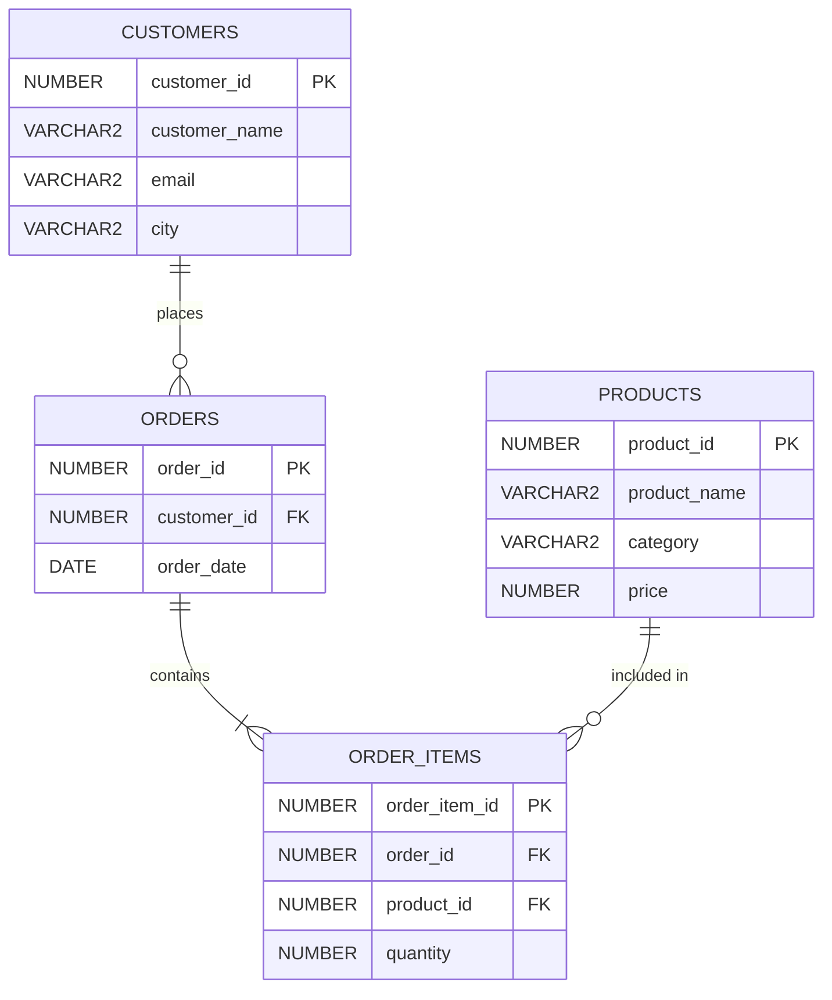

# PL/SQL Assignment One — Sunrise Supermarket

## Student & Course Information
* **Student Name:** Nshimyumukiza Felicien
* **Student ID:** `20251SEN197`
* **Course:** Advanced Database Systems / PL/SQL
* **Group & Deadline:** Group B, Group C, Group I (due Sep 21, 2026, 11:59 PM) / Group D (due Sep 23, 2026, 11:59 PM)
* **DBMS Used:** Oracle Database 23ai Free / 26ai Free
* **Client Tool:** SQL*Plus CLI & Oracle SQL Developer
* **Pluggable Database (PDB):** `FREEPDB1`
* **User Schema:** `SUNRISE_USER`
* **Repository:** `assignment_1_felicien-20251sen197`

---

## 1. Project Summary & Business Scenario

### Project Summary
This project implements a relational database for **Sunrise Supermarket**, a growing grocery store chain operating in Rwanda across **Kigali, Musanze, Huye, Rubavu, and Muhanga**. The database manages customer records, product catalogs, customer orders, and individual basket line-items. 

The schema is populated with realistic retail transaction data and analyzed through advanced SQL techniques:
* **ANSI SQL JOINs** (`INNER JOIN` and `LEFT JOIN`)
* **Common Table Expressions (CTEs)**
* **Window Functions** (`RANK`, `ROW_NUMBER`, cumulative `SUM() OVER`, and `LAG`)

The analysis addresses key operational metrics: customer lifetime value, department revenue contribution, zero-order prospect identification, cumulative daily cash flow, and repeat-purchase velocity.

### Business Scenario
Sunrise Supermarket sells essential consumer goods (staple foods, beverages, household cleaning supplies, and personal care products). Store leadership requires data-driven answers to core operational questions:
1. **Who are our most valuable customers?** Determining above-average spenders allows marketing to launch VIP retention and loyalty rewards.
2. **What products are purchased together?** Analyzing order items helps optimize inventory stocking and high-margin product placement.
3. **Are there registered customers who have never bought?** Identifying inactive accounts reveals conversion opportunities.
4. **How does revenue pace over time?** Tracking cumulative sales reveals momentum toward monthly revenue targets.
5. **How quickly do shoppers return?** Measuring the days between consecutive purchases detects repurchase habits and churn risks.

---

## 2. Database Structure & Relational Schema

### Entity-Relationship Architecture
The database schema consists of four interconnected tables adhering to 3NF normalization:

| Table | Purpose | Primary Key | Foreign Keys / Constraints |
|---|---|---|---|
| **`customers`** | Customer contact profiles and city locations | `customer_id` | Unique `email`, Not Null `customer_name` |
| **`products`** | Supermarket inventory catalog and prices (RWF) | `product_id` | `CHECK (price >= 0)` |
| **`orders`** | Sales order headers and transaction dates | `order_id` | `customer_id` → `customers(customer_id)` |
| **`order_items`** | Line-item quantities resolving M:N relationship | `order_item_id` | `order_id` → `orders`, `product_id` → `products`, `CHECK (quantity > 0)` |



---

## 3. Environment Setup & Execution Screenshots

All database operations were performed in the pluggable database **`FREEPDB1`** under the dedicated schema **`SUNRISE_USER`**.

### 3.1 Switching Container to `FREEPDB1`
```sql
SHOW PDBS;
ALTER SESSION SET CONTAINER = FREEPDB1;
```


```sql
SELECT USER AS current_user,
       SYS_CONTEXT('USERENV', 'CON_NAME') AS container_name
FROM dual;
```


---

### 3.2 User Creation & Privilege Grants
```sql
CREATE USER sunrise_user
IDENTIFIED BY Sunrise123
DEFAULT TABLESPACE users
TEMPORARY TABLESPACE temp
QUOTA UNLIMITED ON users;
```


```sql
GRANT CREATE SESSION,
      CREATE TABLE,
      CREATE VIEW,
      CREATE SEQUENCE,
      CREATE PROCEDURE
TO sunrise_user;
```


```sql
SELECT username FROM dba_users WHERE username = 'SUNRISE_USER';
```


Connecting as `sunrise_user`:
```sql
CONNECT sunrise_user/Sunrise123@localhost:1521/FREEPDB1
```


---

### 3.3 Table Creation (DDL)
```sql
CREATE TABLE customers (
    customer_id   NUMBER PRIMARY KEY,
    customer_name VARCHAR2(100) NOT NULL,
    email         VARCHAR2(100) UNIQUE,
    city          VARCHAR2(50)
);

CREATE TABLE products (
    product_id   NUMBER PRIMARY KEY,
    product_name VARCHAR2(100) NOT NULL,
    category     VARCHAR2(50)  NOT NULL,
    price        NUMBER(10,2)  NOT NULL,
    CONSTRAINT chk_product_price CHECK (price >= 0)
);

CREATE TABLE orders (
    order_id    NUMBER PRIMARY KEY,
    customer_id NUMBER NOT NULL,
    order_date  DATE   NOT NULL,
    CONSTRAINT fk_orders_customer
        FOREIGN KEY (customer_id)
        REFERENCES customers(customer_id)
);

CREATE TABLE order_items (
    order_item_id NUMBER PRIMARY KEY,
    order_id      NUMBER NOT NULL,
    product_id    NUMBER NOT NULL,
    quantity      NUMBER NOT NULL,
    CONSTRAINT fk_items_order
        FOREIGN KEY (order_id)
        REFERENCES orders(order_id),
    CONSTRAINT fk_items_product
        FOREIGN KEY (product_id)
        REFERENCES products(product_id),
    CONSTRAINT chk_item_quantity
        CHECK (quantity > 0)
);
```


---

## 4. Data Population Summary & Row Audits

The database is populated with realistic Rwandan supermarket data, exceeding all assignment requirements:

| Entity | Required Minimum | Inserted Records | Coverage & Notes |
|---|---|---|---|
| **Customers** | At least 5 | **6** | 5 active repeat shoppers across Rwanda + 1 zero-order prospect |
| **Products** | At least 8 | **10** | 4 distinct categories: Food, Beverages, Household, Personal Care |
| **Orders** | At least 15 | **15** | Spanning 01-AUG-2026 to 05-SEP-2026 |
| **Order Items** | At least 25 | **30** | Multi-item shopping baskets with prices in RWF |

### Data Insertion Screenshots

#### 1. Customers Table (6 rows)
```sql
INSERT INTO customers VALUES (1, 'Alice Uwase', 'alice.uwase@gmail.com', 'Kigali');
INSERT INTO customers VALUES (2, 'Eric Mugisha', 'eric.mugisha@gmail.com', 'Musanze');
INSERT INTO customers VALUES (3, 'Grace Mukamana', 'grace.mukamana@gmail.com', 'Huye');
INSERT INTO customers VALUES (4, 'Patrick Niyonzima', 'patrick.niyonzima@gmail.com', 'Rubavu');
INSERT INTO customers VALUES (5, 'Diane Ingabire', 'diane.ingabire@gmail.com', 'Kigali');
INSERT INTO customers VALUES (6, 'Samuel Habimana', 'samuel.habimana@gmail.com', 'Muhanga');
```


---

#### 2. Products Table (10 rows across 4 categories)
```sql
INSERT INTO products VALUES (101, 'Rice 5kg', 'Food', 8500.00);
INSERT INTO products VALUES (102, 'Cooking Oil 1L', 'Food', 3500.00);
INSERT INTO products VALUES (103, 'Sugar 1kg', 'Food', 1800.00);
INSERT INTO products VALUES (104, 'Bread', 'Food', 1200.00);
INSERT INTO products VALUES (105, 'Milk 1L', 'Beverages', 1500.00);
INSERT INTO products VALUES (106, 'Orange Juice 1L', 'Beverages', 3000.00);
INSERT INTO products VALUES (107, 'Bottled Water', 'Beverages', 700.00);
INSERT INTO products VALUES (108, 'Laundry Soap', 'Household', 2200.00);
INSERT INTO products VALUES (109, 'Dishwashing Liquid', 'Household', 2800.00);
INSERT INTO products VALUES (110, 'Toothpaste', 'Personal Care', 2500.00);
```


---

#### 3. Orders Table (15 rows)
```sql
INSERT ALL
  INTO orders VALUES (1001, 1, DATE '2026-08-01')
  INTO orders VALUES (1002, 2, DATE '2026-08-02')
  INTO orders VALUES (1003, 3, DATE '2026-08-04')
  INTO orders VALUES (1004, 4, DATE '2026-08-05')
  INTO orders VALUES (1005, 5, DATE '2026-08-07')
  INTO orders VALUES (1006, 1, DATE '2026-08-10')
  INTO orders VALUES (1007, 2, DATE '2026-08-12')
  INTO orders VALUES (1008, 3, DATE '2026-08-15')
  INTO orders VALUES (1009, 4, DATE '2026-08-17')
  INTO orders VALUES (1010, 5, DATE '2026-08-20')
  INTO orders VALUES (1011, 1, DATE '2026-08-23')
  INTO orders VALUES (1012, 2, DATE '2026-08-25')
  INTO orders VALUES (1013, 3, DATE '2026-08-28')
  INTO orders VALUES (1014, 4, DATE '2026-09-02')
  INTO orders VALUES (1015, 5, DATE '2026-09-05')
SELECT 1 FROM dual;
```


Verifying order record count:
```sql
SELECT COUNT(*) FROM orders;
```


---

#### 4. Order Items Table (30 rows)
```sql
INSERT INTO order_items VALUES (1, 1001, 101, 2);
INSERT INTO order_items VALUES (2, 1001, 105, 3);
...
INSERT INTO order_items VALUES (30, 1015, 110, 3);
COMMIT;
```


Verifying item record count:
```sql
SELECT COUNT(*) AS item_count FROM order_items;
```


---

#### 5. Unified Database Audit
```sql
SELECT 
  (SELECT COUNT(*) FROM customers) AS customers,
  (SELECT COUNT(*) FROM products) AS products,
  (SELECT COUNT(*) FROM orders) AS orders,
  (SELECT COUNT(*) FROM order_items) AS order_items
FROM dual;
```


---

## 5. Analytical Queries, Explanations, Screenshots & Business Interpretations

---

### JOIN Query 1: Order Fulfillment Registry
#### Objective
List every order with the customer's name, city, and order date (`INNER JOIN`: `orders` + `customers`).

#### SQL Code
```sql
SELECT o.order_id,
       c.customer_name,
       c.city,
       TO_CHAR(o.order_date, 'DD-MON-YYYY') AS order_date
FROM orders o
INNER JOIN customers c
  ON o.customer_id = c.customer_id
ORDER BY o.order_date, o.order_id;
```

#### Technical Explanation
* An `INNER JOIN` matches rows where `orders.customer_id = customers.customer_id`.
* Customers who have never placed an order (Samuel Habimana) are excluded because they have no corresponding order record.
* `TO_CHAR(o.order_date, 'DD-MON-YYYY')` ensures consistent date formatting.

#### Execution Screenshot & Results


```text
  ORDER_ID CUSTOMER_NAME        CITY       ORDER_DATE
---------- -------------------- ---------- -----------
      1001 Alice Uwase          Kigali     01-AUG-2026
      1002 Eric Mugisha         Musanze    02-AUG-2026
      1003 Grace Mukamana       Huye       04-AUG-2026
      1004 Patrick Niyonzima    Rubavu     05-AUG-2026
      1005 Diane Ingabire       Kigali     07-AUG-2026
      1006 Alice Uwase          Kigali     10-AUG-2026
      1007 Eric Mugisha         Musanze    12-AUG-2026
      1008 Grace Mukamana       Huye       15-AUG-2026
      1009 Patrick Niyonzima    Rubavu     17-AUG-2026
      1010 Diane Ingabire       Kigali     20-AUG-2026
      1011 Alice Uwase          Kigali     23-AUG-2026
      1012 Eric Mugisha         Musanze    25-AUG-2026
      1013 Grace Mukamana       Huye       28-AUG-2026
      1014 Patrick Niyonzima    Rubavu     02-SEP-2026
      1015 Diane Ingabire       Kigali     05-SEP-2026

15 rows selected.
```

#### Business Interpretation
This query serves as the **Store Dispatch Log**. Logistics teams use this list to schedule deliveries across Kigali, Musanze, Huye, and Rubavu. The continuous sequence confirms healthy demand pacing throughout August and early September 2026.

---

### JOIN Query 2: Basket Line-Item Breakdown
#### Objective
List every order item with product name, category, price, and quantity (`JOIN`: `order_items` + `products`).

#### SQL Code
```sql
SELECT oi.order_item_id,
       oi.order_id,
       p.product_name,
       p.category,
       p.price,
       oi.quantity,
       (p.price * oi.quantity) AS item_total
FROM order_items oi
INNER JOIN products p
  ON oi.product_id = p.product_id
ORDER BY oi.order_id, oi.order_item_id;
```

#### Technical Explanation
* An `INNER JOIN` bridges line items in `order_items` with product attributes in `products` via `product_id`.
* The computed expression `(p.price * oi.quantity)` derives the monetary subtotal in Rwandan Francs (`item_total`).

#### Execution Screenshot & Results


```text
ORDER_ITEM_ID   ORDER_ID PRODUCT_NAME            CATEGORY          PRICE  QUANTITY ITEM_TOTAL
------------- ---------- ----------------------- ------------- --------- --------- ----------
            1       1001 Rice 5kg                Food               8500         2      17000
            2       1001 Milk 1L                 Beverages          1500         3       4500
            3       1002 Cooking Oil 1L          Food               3500         2       7000
            4       1002 Laundry Soap            Household          2200         1       2200
            5       1003 Sugar 1kg               Food               1800         4       7200
            6       1003 Orange Juice 1L         Beverages          3000         2       6000
            7       1004 Bread                   Food               1200         3       3600
            8       1004 Dishwashing Liquid      Household          2800         2       5600
            9       1005 Rice 5kg                Food               8500         1       8500
           10       1005 Toothpaste              Personal Care      2500         2       5000
           11       1006 Cooking Oil 1L          Food               3500         3      10500
           12       1006 Bottled Water           Beverages           700         5       3500
           13       1007 Rice 5kg                Food               8500         2      17000
           14       1007 Sugar 1kg               Food               1800         3       5400
           15       1008 Milk 1L                 Beverages          1500         4       6000
           16       1008 Laundry Soap            Household          2200         2       4400
           17       1009 Orange Juice 1L         Beverages          3000         3       9000
           18       1009 Toothpaste              Personal Care      2500         1       2500
           19       1010 Bread                   Food               1200         5       6000
           20       1010 Dishwashing Liquid      Household          2800         2       5600
           21       1011 Rice 5kg                Food               8500         3      25500
           22       1011 Cooking Oil 1L          Food               3500         2       7000
           23       1012 Sugar 1kg               Food               1800         5       9000
           24       1012 Bottled Water           Beverages           700         6       4200
           25       1013 Milk 1L                 Beverages          1500         3       4500
           26       1013 Orange Juice 1L         Beverages          3000         2       6000
           27       1014 Laundry Soap            Household          2200         4       8800
           28       1014 Dishwashing Liquid      Household          2800         2       5600
           29       1015 Rice 5kg                Food               8500         2      17000
           30       1015 Toothpaste              Personal Care      2500         3       7500

30 rows selected.
```

#### Business Interpretation
This query provides the store's **Itemized Sales Audit**. *Rice 5kg* (8,500 RWF) generates the largest single transaction values (up to 25,500 RWF in Order 1011), while daily essentials like *Milk 1L* and *Bread* provide stable, high-frequency basket volume.

---

### JOIN Query 3: Complete Customer Audit & Inactive Prospect Identification
#### Objective
List all customers and their orders where they exist, including customers with no orders (`LEFT JOIN`: `customers` + `orders`).

#### SQL Code
```sql
SELECT c.customer_id,
       c.customer_name,
       c.city,
       o.order_id,
       TO_CHAR(o.order_date, 'DD-MON-YYYY') AS order_date
FROM customers c
LEFT JOIN orders o
  ON c.customer_id = o.customer_id
ORDER BY c.customer_id, o.order_date;
```

#### Technical Explanation
* A `LEFT OUTER JOIN` retains all customer records, even if no matching orders exist in `orders`.
* For customer `6` (*Samuel Habimana*), `order_id` and `order_date` return `NULL`.

#### Execution Screenshot & Results


```text
CUSTOMER_ID CUSTOMER_NAME        CITY       ORDER_ID ORDER_DATE
----------- -------------------- ---------- -------- -----------
          1 Alice Uwase          Kigali         1001 01-AUG-2026
          1 Alice Uwase          Kigali         1006 10-AUG-2026
          1 Alice Uwase          Kigali         1011 23-AUG-2026
          2 Eric Mugisha         Musanze        1002 02-AUG-2026
          2 Eric Mugisha         Musanze        1007 12-AUG-2026
          2 Eric Mugisha         Musanze        1012 25-AUG-2026
          3 Grace Mukamana       Huye           1003 04-AUG-2026
          3 Grace Mukamana       Huye           1008 15-AUG-2026
          3 Grace Mukamana       Huye           1013 28-AUG-2026
          4 Patrick Niyonzima    Rubavu         1004 05-AUG-2026
          4 Patrick Niyonzima    Rubavu         1009 17-AUG-2026
          4 Patrick Niyonzima    Rubavu         1014 02-SEP-2026
          5 Diane Ingabire       Kigali         1005 07-AUG-2026
          5 Diane Ingabire       Kigali         1010 20-AUG-2026
          5 Diane Ingabire       Kigali         1015 05-SEP-2026
          6 Samuel Habimana      Muhanga

16 rows selected.
```

#### Edge-Case Verification Query
```sql
SELECT c.customer_id,
       c.customer_name,
       o.order_id
FROM customers c
LEFT JOIN orders o
  ON c.customer_id = o.customer_id
WHERE o.order_id IS NULL;
```


#### Business Interpretation
This query serves as a **Customer Conversion Audit**. While customers 1 through 5 are regular purchasers, **Samuel Habimana** in Muhanga has registered but placed zero orders. Marketing can target Samuel with an introductory first-order promotion to activate his account.

---

### CTE Query 1: Above-Average Customer Spending Benchmark
#### Objective
Calculate each customer's total spend (`quantity` × `price`) and return customers above average spend. Use a CTE to compute customer totals first.

#### SQL Code
```sql
WITH customer_totals AS (
    SELECT c.customer_id,
           c.customer_name,
           NVL(SUM(oi.quantity * p.price), 0) AS total_spent
    FROM customers c
    LEFT JOIN orders o
        ON c.customer_id = o.customer_id
    LEFT JOIN order_items oi
        ON o.order_id = oi.order_id
    LEFT JOIN products p
        ON oi.product_id = p.product_id
    GROUP BY c.customer_id, c.customer_name
)
SELECT customer_id,
       customer_name,
       total_spent,
       ROUND((SELECT AVG(total_spent) FROM customer_totals), 2) AS average_spend
FROM customer_totals
WHERE total_spent > (SELECT AVG(total_spent) FROM customer_totals)
ORDER BY total_spent DESC;
```

#### Technical Explanation
* The CTE `customer_totals` calculates each customer's total expenditure using `LEFT JOIN` and `NVL()` so zero-order customers are included with 0 RWF.
* Across all 6 customers, total store revenue is **231,600 RWF**, producing a store benchmark average of:
  $$\text{Average Spend} = \frac{68,000 + 49,600 + 44,800 + 35,100 + 34,100 + 0}{6} = \frac{231,600}{6} = \mathbf{38,600\text{ RWF}}$$
* The outer query filters `WHERE total_spent > (SELECT AVG(total_spent) FROM customer_totals)` to extract the top-performing shoppers.

#### Execution Screenshot & Results


```text
CUSTOMER_ID CUSTOMER_NAME        TOTAL_SPENT AVERAGE_SPEND
----------- -------------------- ----------- -------------
          1 Alice Uwase                68000         38600
          5 Diane Ingabire             49600         38600
          2 Eric Mugisha               44800         38600

3 rows selected.
```

#### Complete Customer Spending Table (From SQL*Plus Execution)
```text
CUSTOMER_ID CUSTOMER_NAME        TOTAL_SPENT
----------- -------------------- -----------
          1 Alice Uwase                68000
          5 Diane Ingabire             49600
          2 Eric Mugisha               44800
          4 Patrick Niyonzima          35100
          3 Grace Mukamana             34100
          6 Samuel Habimana                0

6 rows selected.
```

#### Business Interpretation
**Alice Uwase** (68,000 RWF), **Diane Ingabire** (49,600 RWF), and **Eric Mugisha** (44,800 RWF) represent the store's high-value core. These three shoppers generate **162,400 RWF (70.1%)** of the supermarket's total revenue, qualifying them for the Sunrise VIP Loyalty Rewards Program.

---

### Window Query 1: Customer Spending Leaderboard (`RANK` & `DENSE_RANK`)
#### Objective
Rank customers by total amount spent, highest first.

#### SQL Code
```sql
WITH customer_totals AS (
    SELECT c.customer_id,
           c.customer_name,
           NVL(SUM(oi.quantity * p.price), 0) AS total_spent
    FROM customers c
    LEFT JOIN orders o ON c.customer_id = o.customer_id
    LEFT JOIN order_items oi ON o.order_id = oi.order_id
    LEFT JOIN products p ON oi.product_id = p.product_id
    GROUP BY c.customer_id, c.customer_name
)
SELECT customer_id,
       customer_name,
       total_spent,
       RANK() OVER (ORDER BY total_spent DESC) AS spending_rank,
       DENSE_RANK() OVER (ORDER BY total_spent DESC) AS dense_spending_rank
FROM customer_totals
ORDER BY spending_rank, customer_id;
```

#### Technical Explanation
* `RANK() OVER (ORDER BY total_spent DESC)` assigns spending positions from highest to lowest. If ties occur, `RANK()` skips subsequent ranks, whereas `DENSE_RANK()` maintains contiguous integer ordering.

#### Execution Results
```text
Cust ID Customer Name        Total Spent (RWF)  Rank Dense Rank
------- -------------------- ----------------- ----- ----------
      1 Alice Uwase                      68000     1          1
      5 Diane Ingabire                   49600     2          2
      2 Eric Mugisha                     44800     3          3
      4 Patrick Niyonzima                35100     4          4
      3 Grace Mukamana                   34100     5          5
      6 Samuel Habimana                      0     6          6

6 rows selected.
```

#### Business Interpretation
This leaderboard clearly highlights customer contribution tiers. Alice Uwase holds Rank #1. Management can use these ranks to allocate personalized promotional discounts and loyalty perks proportionally.

---

### Window Query 2: Customer Order Chronology (`ROW_NUMBER`)
#### Objective
Number each customer's orders in the order placed.

#### SQL Code
```sql
SELECT o.order_id,
       o.customer_id,
       c.customer_name,
       TO_CHAR(o.order_date, 'DD-MON-YYYY') AS order_date,
       ROW_NUMBER() OVER (
           PARTITION BY o.customer_id 
           ORDER BY o.order_date, o.order_id
       ) AS customer_order_seq
FROM orders o
INNER JOIN customers c
  ON o.customer_id = c.customer_id
ORDER BY o.customer_id, customer_order_seq;
```

#### Technical Explanation
* `PARTITION BY o.customer_id` resets order numbering for each customer.
* `ORDER BY o.order_date, o.order_id` sequences orders chronologically starting at 1.

#### Execution Results
```text
Order ID Cust ID Customer Name        Order Date     Order #
-------- ------- -------------------- -------------- -------
    1001       1 Alice Uwase          01-AUG-2026          1
    1006       1 Alice Uwase          10-AUG-2026          2
    1011       1 Alice Uwase          23-AUG-2026          3
    1002       2 Eric Mugisha         02-AUG-2026          1
    1007       2 Eric Mugisha         12-AUG-2026          2
    1012       2 Eric Mugisha         25-AUG-2026          3
    1003       3 Grace Mukamana       04-AUG-2026          1
    1008       3 Grace Mukamana       15-AUG-2026          2
    1013       3 Grace Mukamana       28-AUG-2026          3
    1004       4 Patrick Niyonzima    05-AUG-2026          1
    1009       4 Patrick Niyonzima    17-AUG-2026          2
    1014       4 Patrick Niyonzima    02-SEP-2026          3
    1005       5 Diane Ingabire       07-AUG-2026          1
    1010       5 Diane Ingabire       20-AUG-2026          2
    1015       5 Diane Ingabire       05-SEP-2026          3

15 rows selected.
```

#### Business Interpretation
Every active customer placed exactly 3 orders across August and September. Filtering for `customer_order_seq = 1` isolates customer acquisition transactions, while `customer_order_seq >= 2` tracks retention and repeat purchasing habits.

---

### Window Query 3: Running Total of Revenue Over Time (`SUM() OVER`)
#### Objective
Show a running total of revenue over time, ordered by order date.

#### SQL Code
```sql
WITH order_revenue AS (
    SELECT o.order_id,
           o.order_date,
           c.customer_name,
           SUM(oi.quantity * p.price) AS order_total
    FROM orders o
    INNER JOIN customers c ON o.customer_id = c.customer_id
    INNER JOIN order_items oi ON o.order_id = oi.order_id
    INNER JOIN products p ON oi.product_id = p.product_id
    GROUP BY o.order_id, o.order_date, c.customer_name
)
SELECT order_id,
       TO_CHAR(order_date, 'DD-MON-YYYY') AS order_date,
       customer_name,
       order_total,
       SUM(order_total) OVER (
           ORDER BY order_date, order_id
           ROWS BETWEEN UNBOUNDED PRECEDING AND CURRENT ROW
       ) AS running_total_revenue
FROM order_revenue
ORDER BY order_date, order_id;
```

#### Technical Explanation
* The CTE calculates each order's monetary subtotal by joining orders with items and products.
* The window function `SUM(order_total) OVER (ORDER BY order_date, order_id ROWS BETWEEN UNBOUNDED PRECEDING AND CURRENT ROW)` calculates an accumulative revenue pacing progression.

#### Execution Results
```text
Order ID Order Date     Customer Name        Order Total (RWF) Running Total (RWF)
-------- -------------- -------------------- ----------------- -------------------
    1001 01-AUG-2026    Alice Uwase                      21500               21500
    1002 02-AUG-2026    Eric Mugisha                      9200               30700
    1003 04-AUG-2026    Grace Mukamana                   13200               43900
    1004 05-AUG-2026    Patrick Niyonzima                 9200               53100
    1005 07-AUG-2026    Diane Ingabire                   13500               66600
    1006 10-AUG-2026    Alice Uwase                      14000               80600
    1007 12-AUG-2026    Eric Mugisha                     22400              103000
    1008 15-AUG-2026    Grace Mukamana                   10400              113400
    1009 17-AUG-2026    Patrick Niyonzima                11500              124900
    1010 20-AUG-2026    Diane Ingabire                   11600              136500
    1011 23-AUG-2026    Alice Uwase                      32500              169000
    1012 25-AUG-2026    Eric Mugisha                     13200              182200
    1013 28-AUG-2026    Grace Mukamana                   10500              192700
    1014 02-SEP-2026    Patrick Niyonzima                14400              207100
    1015 05-SEP-2026    Diane Ingabire                   24500              231600

15 rows selected.
```

#### Business Interpretation
This query serves as the **Executive Cash-Flow Curve**. Cumulative revenue crossed **100,000 RWF** on August 12, **200,000 RWF** on September 02, and concluded at **231,600 RWF** on September 05. Management can use this running pacing curve to project monthly revenue performance.

---

### Window Query 4: Repurchase Velocity & Intervals (`LAG`)
#### Objective
For each customer with more than one order, show days between the current and previous order.

#### SQL Code
```sql
WITH repeat_customers AS (
    SELECT customer_id
    FROM orders
    GROUP BY customer_id
    HAVING COUNT(*) > 1
),
ordered_history AS (
    SELECT o.order_id,
           o.customer_id,
           c.customer_name,
           o.order_date,
           LAG(o.order_date, 1) OVER (
               PARTITION BY o.customer_id 
               ORDER BY o.order_date, o.order_id
           ) AS prev_order_date
    FROM orders o
    INNER JOIN customers c ON o.customer_id = c.customer_id
    WHERE o.customer_id IN (SELECT customer_id FROM repeat_customers)
)
SELECT order_id,
       customer_id,
       customer_name,
       TO_CHAR(order_date, 'DD-MON-YYYY') AS order_date,
       TO_CHAR(prev_order_date, 'DD-MON-YYYY') AS prev_order_date,
       ROUND(order_date - prev_order_date) AS days_between_orders
FROM ordered_history
ORDER BY customer_id, order_date;
```

#### Technical Explanation
* The CTE `repeat_customers` filters out single-order buyers and non-purchasers with `HAVING COUNT(*) > 1`.
* `LAG(o.order_date, 1) OVER (PARTITION BY o.customer_id ORDER BY o.order_date, o.order_id)` retrieves each customer's previous order date.
* Native Oracle date subtraction (`order_date - prev_order_date`) calculates elapsed days as a direct number. Initial orders yield `NULL`.

#### Execution Results
```text
Order ID Cust ID Customer Name        Order Date     Prev Date      Days Apart
-------- ------- -------------------- -------------- -------------- ----------
    1001       1 Alice Uwase          01-AUG-2026
    1006       1 Alice Uwase          10-AUG-2026    01-AUG-2026             9
    1011       1 Alice Uwase          23-AUG-2026    10-AUG-2026            13
    1002       2 Eric Mugisha         02-AUG-2026
    1007       2 Eric Mugisha         12-AUG-2026    02-AUG-2026            10
    1012       2 Eric Mugisha         25-AUG-2026    12-AUG-2026            13
    1003       3 Grace Mukamana       04-AUG-2026
    1008       3 Grace Mukamana       15-AUG-2026    04-AUG-2026            11
    1013       3 Grace Mukamana       28-AUG-2026    15-AUG-2026            13
    1004       4 Patrick Niyonzima    05-AUG-2026
    1009       4 Patrick Niyonzima    17-AUG-2026    05-AUG-2026            12
    1014       4 Patrick Niyonzima    02-SEP-2026    17-AUG-2026            16
    1005       5 Diane Ingabire       07-AUG-2026
    1010       5 Diane Ingabire       20-AUG-2026    07-AUG-2026            13
    1015       5 Diane Ingabire       05-SEP-2026    20-AUG-2026            16

15 rows selected.
```

#### Business Interpretation
Repeat visit velocity shows high predictability:
* Customers repurchase within **9 to 16 days** of their prior purchase (averaging **12.6 days**).
* Initial repeat purchases occur rapidly (Alice within 9 days, Eric within 10 days, Grace within 11 days).
* If a customer exceeds **18 days** without a repeat order, an automated SMS reminder or promotional voucher can be sent to prevent churn.

---

## 6. Technical Challenges & Engineering Resolutions

| # | Challenge Encountered | Technical Root Cause | Engineering Resolution |
|---|---|---|---|
| 1 | **ORA-65096 User Creation in Root Container** | Creating `sunrise_user` while connected to `CDB$ROOT` failed because Oracle requires the `C##` prefix for common users in the root container. | Switched session container to the pluggable database before running user DDL: `ALTER SESSION SET CONTAINER = FREEPDB1;`. |
| 2 | **ORA-02291 Foreign Key Violation during Orders Insert** | Attempting to insert orders before inserting customer records violated foreign key constraint `FK_ORDERS_CUSTOMER`. | Followed strict dependency order: inserted customers and products first, followed by orders, and lastly order items. |
| 3 | **SP2-0734 Unrecognized Command on Blank Lines in INSERT ALL** | In SQL*Plus, blank lines cause statement buffering to terminate when `SQLBLANKLINES` is off, splitting multi-line statements. | Populated `order_items` using individual single-line `INSERT` statements and enabled `SET SQLBLANKLINES ON`. |
| 4 | **Uncommitted Transaction Rollback in SQL\*Plus** | In Oracle, DDL statements auto-commit, but DML statements (`INSERT`) stay uncommitted in a private transaction buffer until committed. Exiting without commit caused `order_items` to have 0 rows. | Added an explicit `COMMIT;` statement at the conclusion of `02_data.sql` and verified row persistence using aggregate count audits. |
| 5 | **SQL\*Plus Trailing Hyphen Line Continuation** | In SQL\*Plus, header prompts ending in a hyphen (`-`) are parsed as line-continuation characters, causing following SQL queries to merge into the prompt and throw syntax errors (`SP2-0023`, `ORA-03048`). | Replaced all prompt separator bars with equals characters (`PROMPT =========================`), eliminating trailing hyphens. |
| 6 | **Handling Customers with Zero Orders in Aggregate Queries** | Using `INNER JOIN` in spending and ranking queries completely eliminates registered customers who haven't placed orders. | Utilized `LEFT JOIN` combined with `NVL(SUM(quantity * price), 0)` so zero-order prospects (Samuel Habimana) are retained with a valid 0 RWF total. |

---

## 7. How to Run the Project

### Prerequisites
* Oracle AI Database 23ai Free / 26ai Free (or compatible Oracle Database)
* SQL*Plus CLI or Oracle SQL Developer
* Pluggable database `FREEPDB1` opened in read-write mode

---

### Method 1: Using the Master Script (Recommended)

1. Open PowerShell or Command Prompt.
2. Navigate to the project root directory:
   ```powershell
   cd "D:\New folder"
   ```
3. Connect to `FREEPDB1` as `sunrise_user`:
   ```powershell
   sqlplus sunrise_user/Sunrise123@localhost:1521/FREEPDB1
   ```
4. Execute the master script:
   ```sql
   @run_all.sql
   ```
   *This script runs schema creation, data insertion, column formatting, and executes all 8 queries in sequence.*

---

### Method 2: Running Modular Scripts

You can also run the modular scripts individually inside SQL*Plus:
```sql
@sql/01_create_tables.sql
@sql/02_insert_data.sql
@sql/03_join_queries.sql
@sql/04_cte_query.sql
@sql/05_window_queries.sql
```

Verify populated row counts:
```sql
SELECT
    (SELECT COUNT(*) FROM customers) AS customers,
    (SELECT COUNT(*) FROM products) AS products,
    (SELECT COUNT(*) FROM orders) AS orders,
    (SELECT COUNT(*) FROM order_items) AS order_items
FROM dual;
```
Expected counts: **6 customers, 10 products, 15 orders, 30 order items**.

---

### Method 3: Using Oracle SQL Developer

1. Launch **Oracle SQL Developer**.
2. Add a new Database Connection:
   * **Connection Name:** `FREEPDB1_Sunrise`
   * **Username:** `sunrise_user`
   * **Password:** `Sunrise123`
   * **Hostname:** `localhost`
   * **Port:** `1521`
   * **Service Name:** `freepdb1`
3. Open `run_all.sql` and press **F5** (Run Script).

---

## 8. Repository Structure

```text
assignment_1_felicien-20251sen197/
├── 01_schema.sql           # DDL schema definition & constraints (root)
├── 02_data.sql             # 6 customers, 10 products, 15 orders, 30 order items + COMMIT
├── 03_queries.sql          # All 8 JOIN, CTE, and Window queries (root)
├── run_all.sql             # Master execution script with column formatting
├── README.md               # Complete project documentation with embedded screenshots
├── sql/                    # Modular SQL execution scripts
│   ├── 01_create_tables.sql
│   ├── 02_insert_data.sql
│   ├── 03_join_queries.sql
│   ├── 04_cte_query.sql
│   └── 05_window_queries.sql
└── screenshots/            # Actual execution screenshots from FREEPDB1 SQL*Plus
    ├── switch pdb to freepdb1.png
    ├── select curent freepdb1 user.png
    ├── creating user.png
    ├── grant user permissions.png
    ├── verify user existance.png
    ├── connect to sunriser.png
    ├── table created.png
    ├── user insert.png
    ├── product insertion.png
    ├── insert into 15 rows.png
    ├── order count.png
    ├── orders inserted.png
    ├── order items inserted.png
    ├── count for products.png
    ├── count for orders.png
    ├── full database count.png
    ├── Order joined with customers.png
    ├── Order items joined with products..png
    ├── All customers and their orders.png
    ├── Verify that the customer without orders appears.png
    └── every customers total.png
```

---
*Assignment completed in accordance with academic integrity guidelines for PL/SQL Assignment One.*
